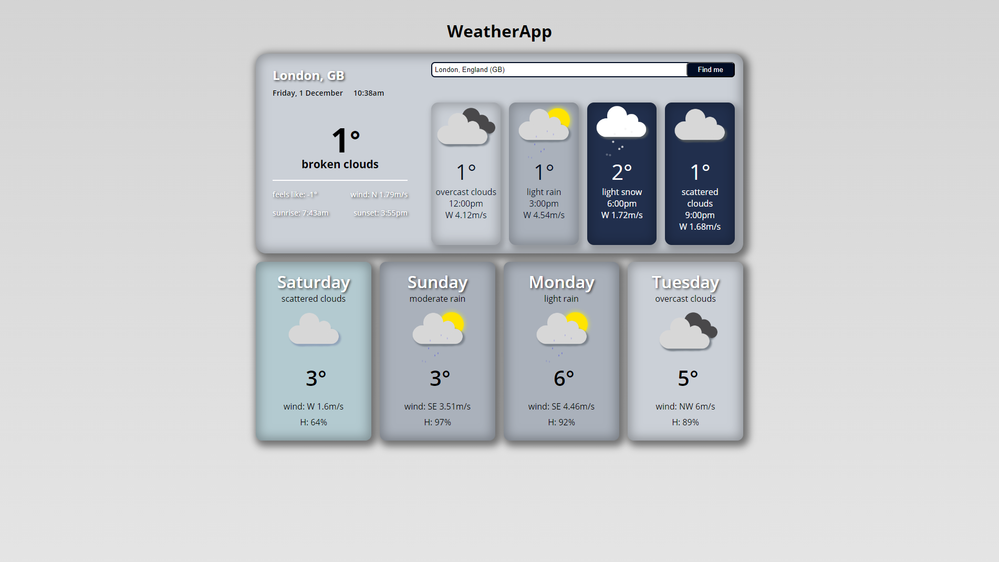

# WeatherApp

## 🌐 Project

WeatherApp is a web application I built to provide real-time weather information using HTML, CSS (SASS), and JavaScript. It fetches data from the OpenWeather API and displays current weather and forecasts in a clean, responsive interface. This project helped me practice API integration, DOM manipulation, and responsive design.



## ✨ Features

- **Current Weather Display:** Shows weather conditions for the current time.
- **Forecast Information:** Provides a forecast for 4 time stamps, 3 hours apart, on the current day and the next 4 days.
- **Search Functionality:** Search weather by city or location.
- **Geolocation Support:** If permitted, the app can fetch weather for your current location. If not, it defaults to Dehradun.
- **Custom Weather Animations:** Animations for different weather conditions.
- **Mobile-First Design:** Fully responsive and works great on mobile.

## 🔧 Installation and Setup

1. Clone this repository:

```
git clone https://github.com/AryanBartwal/Weather-app.git
```

2. Navigate to the project directory:

```
cd Weather-app
```

3. Open `index.html` in your browser, or use the Live Server extension in VS Code for the best experience.

## 🧠 What I Learned

- How to work with external APIs (OpenWeather)
- Handling geolocation and fallbacks in the browser
- Creating custom UI animations with CSS/SASS
- Building a mobile-first, responsive web app
- Improving user experience with error handling and default behaviors

## 🛠️ Technology Stack

- HTML
- SASS (CSS)
- JavaScript (Vanilla)
- OpenWeather API

## 🤝 Contributing

Suggestions and improvements are welcome! Feel free to open an issue or submit a pull request.

## ⭐️ Show your support

If you found this project helpful, please give it a star!

## 📝 License

This project is open source and available under the MIT License.

---

**Author:** Aryan Bartwal
